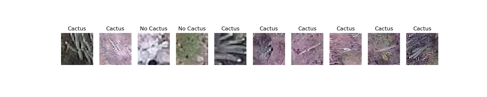
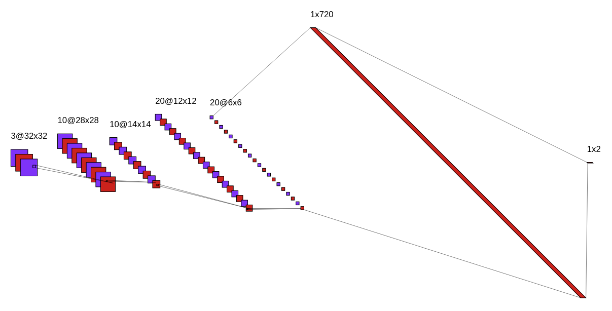
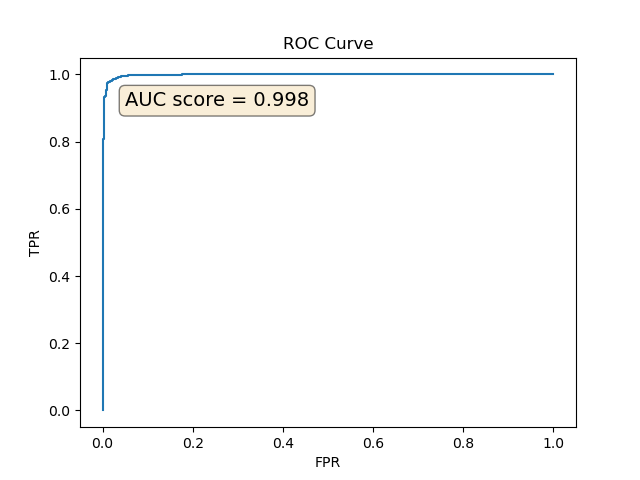

# Aerial Cactus Identification

This is a learning project where I implement a convolutional neural network using PyTorch for binary classification. I have used a small sized dataset from Kaggle to be able to quickly run the model on my local machine.
If you would like to see how the model performs and submit the results to [the competition](https://www.kaggle.com/c/aerial-cactus-identification/) to see the score yourself, you can just use the saved model by running `python run_saved_model.py`&mdash;saving the results to `results.csv`. To see the whole training process and visualizations of results, you can run `python main.py`.

Below is a list of the other scripts and their functions:

* `parameters.py`: Model parameters (optimizer, learning rate, loss function etc.) and global variables used in other scripts.
* `model.py`: Includes `Net` class&mdash;the classifier.
* `dataset.py`: Includes `ACIDataset` class for putting the dataset in PyTorch-readable format.
* `load_data.py`: Places the data in `Dataloader`s&mdash;PyTorch data iterators.
* `utilities.py`: Training and testing loops, plotting functions etc.

## Dataset

The dataset used in this project can be found on [Kaggle](https://www.kaggle.com/c/aerial-cactus-identification/data). This dataset contains a large number of 32x32 RGB images of aerial photos of a cactus. There are 17500 images in the training test and 4000 in the test set. Below is a small selection from the dataset.

  

## Model

A simple CNN is used. The model is summarized in the figure below and can also be looked at `model.py`.

  

## Results

Here is a section from `results.csv`:

|id                                  |has_cactus            |
|------------------------------------|----------------------|
|000940378805c44108d287872b2f04ce.jpg|0.9978019595146179    |
|0017242f54ececa4512b4d7937d1e21e.jpg|0.9999499320983887    |
|001ee6d8564003107853118ab87df407.jpg|0.008762945421040058  |
|002e175c3c1e060769475f52182583d0.jpg|0.0033420242834836245 |
|0036e44a7e8f7218e9bc7bf8137e4943.jpg|0.812560498714447     |
|0038ed6f7417b8275b393307f66cb1e3.jpg|0.9998985528945923    |
|0059dfa41de4441fc23b9a4b98ba99cb.jpg|0.999962568283081     |
|0061bd302d735db829418cb90b4e6040.jpg|0.9999998807907104    |.

Since the labels of the real test set are unknown, the AUC score can only be seen after submitting the results to Kaggle. To visualize the model's performance, the training set is split into 3: 

* Training (%70)
* Validation (%20)
* Test (%10).

The AUC score on this test set taken from the training set provided by Kaggle is 0.998&mdash;see the figure below. After training the model with %100 of the training set and submitting the results to Kaggle, the score is 0.995.

  

